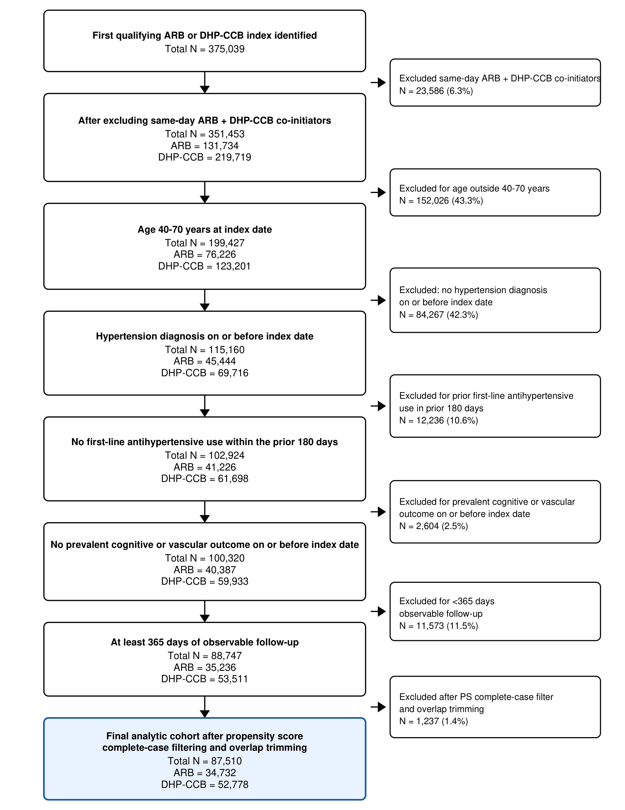
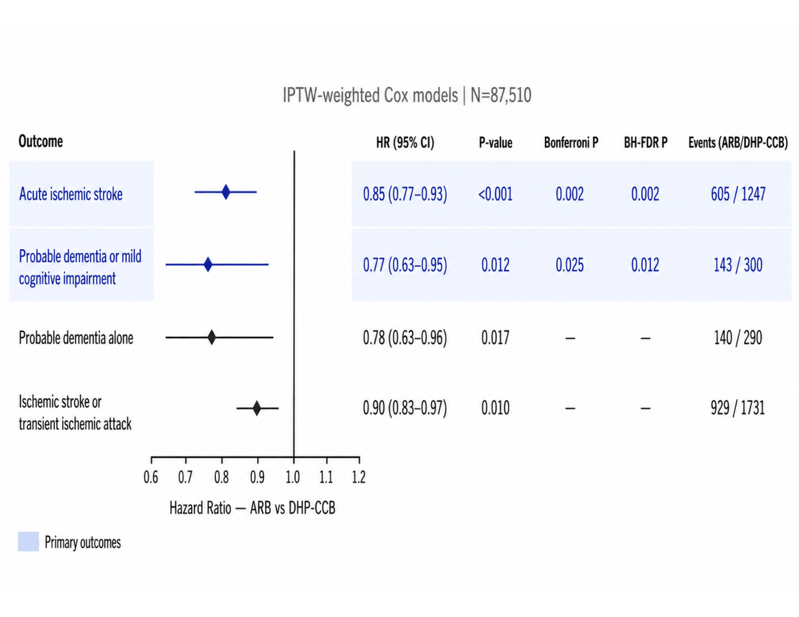

# Angiotensin Receptor Blocker vs Dihydropyridine Calcium Channel Blocker Initiation and Risk of Stroke and Dementia

Reproducible target-trial-emulation (TTE) pipeline comparing **ARB** versus
**dihydropyridine calcium-channel-blocker (DHP-CCB)** antihypertensive
initiation on cognitive (probable dementia / MCI) and vascular (acute ischemic
stroke) outcomes, using new-user active-comparator design with IPTW-weighted
Cox models and death-censoring.

One command regenerates **every computed table and figure in the manuscript**
from the raw AIRMS extracts.

## Abstract

**Importance:** Angiotensin receptor blockers (ARBs) and dihydropyridine calcium channel blockers (DHP-CCBs) are commonly used first-line antihypertensives, but direct comparisons of cerebrovascular and cognitive outcomes after initiation of these therapies in the same population remain limited.

**Objective:** To compare risk of incident acute ischemic stroke and dementia or mild cognitive impairment (MCI) after ARB vs DHP-CCB initiation among adults with hypertension.

**Design:** Active-comparator, new-user target trial emulation using electronic health record data from 2006 through 2025.

**Setting:** Large urban academic health system in New York City.

**Participants:** Adults aged 40 to 70 years with hypertension who initiated an ARB or index-eligible DHP-CCB after a 180-day antihypertensive washout with 1 year or more of observable follow-up.

**Exposures:** ARB-based vs DHP-CCB-based antihypertensive initiation.

**Main Outcomes and Measures:** Primary outcomes were incident acute ischemic stroke and a cognitive composite of probable dementia or MCI. Stabilized inverse probability of treatment-weighted Cox models estimated hazard ratios (HRs).

**Results:** The cohort included 87,510 adults, including 34,732 ARB and 52,778 DHP-CCB initiators. Mean age was approximately 58 years, and 47.6% were female. After weighting, baseline covariates were closely balanced (maximum absolute standardized mean difference, 0.013). ARB initiation was associated with lower risk of acute ischemic stroke vs DHP-CCB initiation (605 vs 1247 events; HR, 0.85; 95% CI, 0.77-0.93; Bonferroni-adjusted P = .002) and lower risk of probable dementia or MCI in the primary analysis (143 vs 300 events; HR, 0.77; 95% CI, 0.63-0.95; Bonferroni-adjusted P = .02). Sensitivity analyses supported the ischemic stroke finding across monotherapy-only, baseline blood pressure-adjusted, and extended follow-up analyses. The dementia/MCI association remained directionally favorable but did not retain statistical significance in some sensitivity analyses.

**Conclusions and Relevance:** In this target trial emulation, ARB initiation was associated with lower risk of both acute ischemic stroke and probable dementia or MCI compared with DHP-CCB initiation. When either class is clinically appropriate, ARB-based initiation may warrant consideration as a strategy associated with more favorable cerebrovascular and cognitive outcome patterns.

## Quick Start

```bash
pip install -r requirements.txt              # pinned deps (Python 3.13)
cp config/paths.example.yml config/paths.yml
# Edit config/paths.yml: set base_dir to this project's location on your machine
python main.py --all                      # regenerate all artifacts
```

## Key Figures

**Figure 1: Cohort Selection Flow Diagram**  


**Figure 2: Forest Plot of Hazard Ratios**  


## Tests

Data-free unit tests (config load/merge + validation, covariate-balance SMD
math, p-value formatting / multiple-testing family size) — no raw extracts or
PHI required:

```bash
pip install -r requirements-dev.txt
pytest
```

Other entry points:

```bash
python main.py --core                     # core + reporting artifacts only
python main.py --sensitivity              # the 5 sensitivity analyses only
python main.py --step table2              # run one step by name (or core index)
python main.py --dry-run                  # validate config + print plan, no writes
python main.py --show-config              # print merged config and exit
python main.py --list-required-files      # check raw data files exist and exit
```

Every run writes a version-stamped log (`ConfigV1.0 (2026-05-31) @ <timestamp>`)
to `outputs/logs/`.

## Pipeline

Run in order by `main.py` (`src/index.md` has the full DAG):

**Core** (`src/core/`)
0. `define_ingredients` — ingredient summary (diagnostic, read-only)
1. `build_cohort` — indexed cohort (new-user, washout, exclusions, death-censor)
2. `compute_outcomes` — outcomes, propensity score, IPTW, covariate balance
3. `table1` — baseline characteristics (± IPTW)
4. `add_pvalues` — baseline p-values (augments Table 1)
5. `table2` — IPTW-Cox hazard ratios (+ full Cox coefficients)
6. `diagnostics` — PS overlap, IPTW weights, Schoenfeld PH tests
7. `plot_forest` — forest plot
8. `plot_cumulative` — IPTW cumulative-incidence curves

**Reporting** (`src/reporting/`, built from core outputs)
- `cohort_flow`, `balance_plot`, `ps_diagnostics`, `concept_definitions`,
  `followup_timing` — see `src/reporting/index.md`.

**Sensitivity** (`src/sensitivity/`, independent; read the survival dataset)
- `monotherapy`, `appendicitis_falsification`, `bp_hierarchy`,
  `extended_followup`, `curve_divergence` — see `src/sensitivity/index.md`.

## Manuscript artifact map

Each computed manuscript artifact and the output file(s) that regenerate it.
Output files carry **semantic names** (not manuscript numbers), so the
`table1`/`table2` code modules write `baseline_characteristics.csv` /
`hazard_ratios.csv` — avoiding the Manuscript-Table-2-vs-3 confusion.

| Manuscript artifact | Module | Output file(s) (under `outputs/`) |
|---|---|---|
| Main Table 1 — target-trial specification | — | *static (design prose; not computed)* |
| **Main Figure 1 — cohort flow** | `cohort_flow` | `core/cohort_flow.csv`, `core/cohort_flow.png` |
| Main Table 2 — baseline ± IPTW | `table1` + `add_pvalues` | `core/baseline_characteristics.csv`, `core/baseline_characteristics_pvalues.csv` |
| Main Figure 2 — forest plot | `plot_forest` | `core/forest_plot.png` / `.pdf` |
| Main Table 3 — hazard ratios | `table2` | `core/hazard_ratios.csv` |
| Supp Fig 1 — PS overlap | `diagnostics` | `core/ps_overlap.png` |
| **Supp Fig 2 — covariate-balance love plot** | `balance_plot` | `core/covariate_balance_love_plot.png` |
| Supp Fig 3 — IPTW cumulative incidence | `plot_cumulative` | `core/cumulative_event_*.png` / `.pdf` |
| **Supp Table 1 — PS / IPTW diagnostics** | `ps_diagnostics` | `core/ps_iptw_diagnostics.csv` |
| Supp Table 2 — PH / Schoenfeld | `diagnostics` | `core/ph_schoenfeld.csv` |
| **Supp Table 3 — concept definitions** | `concept_definitions` | `core/concept_definitions.csv` |
| **Supp Table 4 — full Cox coefficients** | `table2` (GAP5) | `core/cox_coefficients.csv` |
| Supp Table 5 — BP-adjusted sensitivity | `bp_hierarchy` | `sensitivity/bp_hierarchy/bp_model_hierarchy.csv` |
| Supp Table 6 — monotherapy | `monotherapy` | `sensitivity/monotherapy/monotherapy_sensitivity_*.csv` |
| **Supp Table 7 — follow-up / event timing** | `followup_timing` (+ `curve_divergence`) | `core/followup_duration.csv`, `core/followup_timing.csv`, `sensitivity/curve_divergence/*.csv` |
| Supp Table 8 — extended follow-up | `extended_followup` | `sensitivity/extended_followup/results.csv`, `qc_report.md` |
| Supp Table 9 — appendicitis falsification | `appendicitis_falsification` | `sensitivity/appendicitis_falsification/appendicitis_falsification_results.csv` |

## Configuration

Two-tier YAML, loaded and merged by `src/config.py` into frozen dataclasses:

- `config/analysis.yml` — clinical definitions, study parameters, drug lists,
  concept IDs, design decisions. Version-controlled and shared; **do not change
  values** (they are verified against the original `run01` config and define the
  reproduced result).
- `config/paths.yml` — machine-local paths (`base_dir` + specific parquet
  references). Gitignored; copy from `config/paths.example.yml` and set
  `base_dir`.

## Data

Raw AIRMS extracts live under `data/raw/` (gitignored) plus a small appendicitis
falsification extract under `data/raw/appendicitis/`. `data/EXTRACTS.md`
documents the provenance and references `DOWNLOAD_MANIFEST.csv` (the export's
authoritative file index). Raw data extraction itself (`src/omop_extract/`) needs protected OMOP/BioMe database
access.

## Outputs

Generated into `outputs/` (gitignored, fully regenerable):

- `outputs/core/` — cohort, survival dataset, tables, figures, reporting artifacts
- `outputs/sensitivity/<name>/` — one folder per sensitivity analysis
- `outputs/logs/` — timestamped, config-version-stamped run logs


## Repository layout

```
main.py     pipeline entry point / CLI
config/     analysis.yml (shared), paths.example.yml (template), paths.yml (local)
data/       EXTRACTS.md + raw/ (gitignored)
src/        config.py, core/, reporting/, sensitivity/, omop_extract/
tests/      data-free unit tests (pytest)
docs/       PIPELINE_EXECUTION_PLAN.md, CONFIG_DESIGN.md
legacy/     original run01 Scripts/ + planning docs (archival, superseded by src/)
outputs/    core/, sensitivity/, logs/ (gitignored, regenerable)
LICENSE     MIT (code only; AIRMS/BioMe data not covered, not redistributable)
```

Not in this repository (protected or regenerable): raw AIRMS extracts, the
patient-level `Analysis Datasets/`, and the `Manuscript/` sources — all kept
locally and excluded via `.gitignore`.

See `docs/PIPELINE_EXECUTION_PLAN.md` for the full design rationale,
canonical-design proof, and decisions log.
